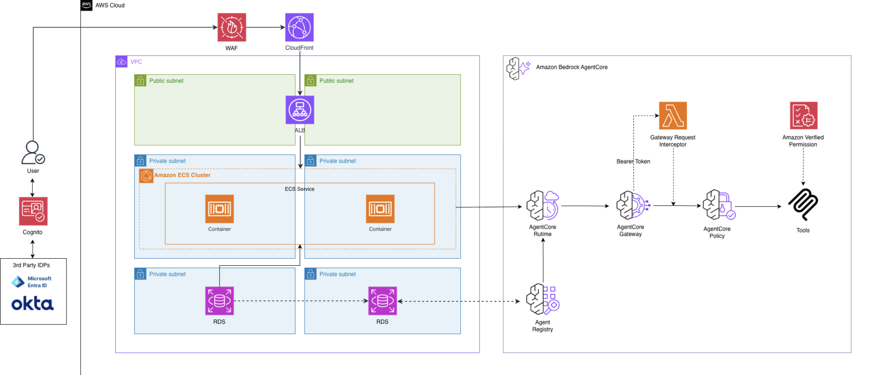
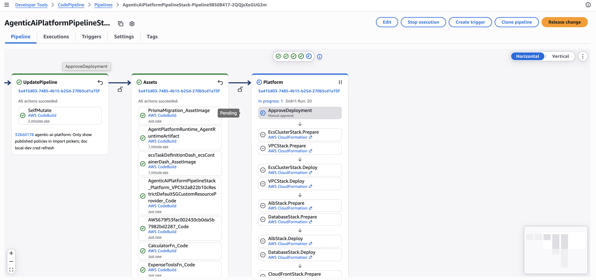
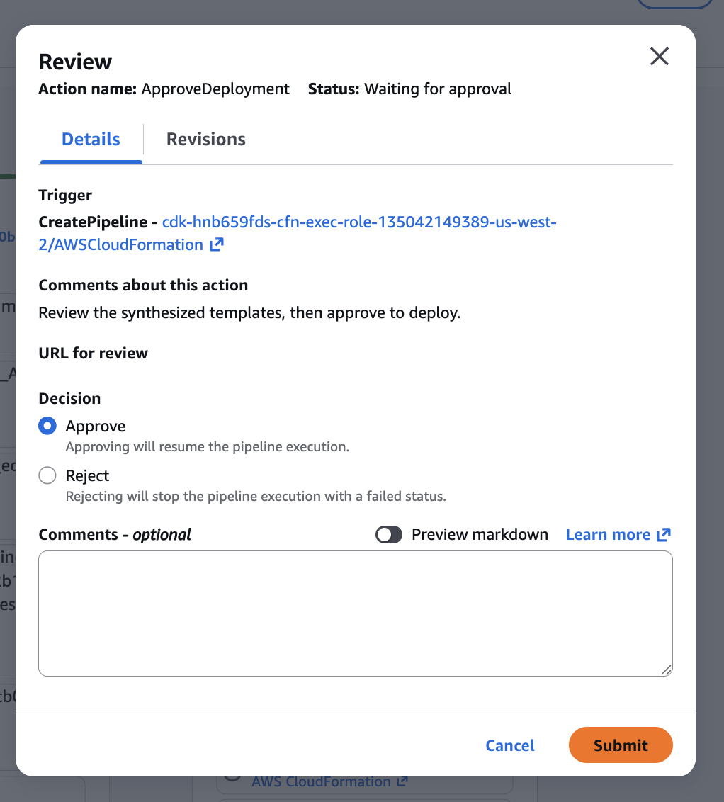
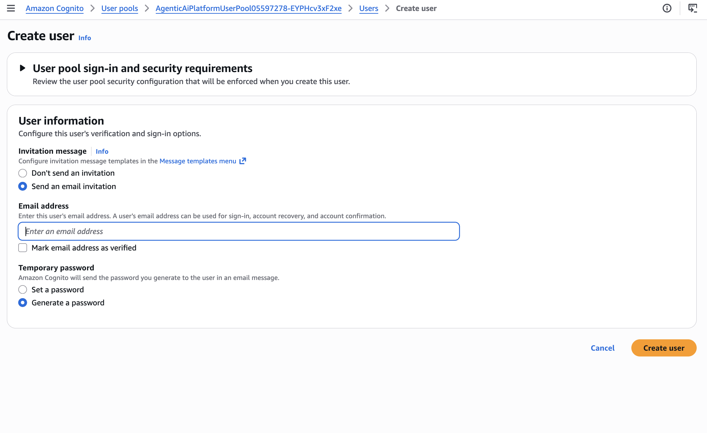

# Agentic AI Platform

A deployable reference platform for building, governing, and running AI agents on
AWS. It pairs a [Next.js](https://nextjs.org) management dashboard with a
[Strands](https://github.com/strands-agents)-based agent runtime, fronted by
**Amazon Bedrock AgentCore** Gateway and Runtime, with per-identity authorization
enforced through a request interceptor and Cedar policy.

> Built entirely with AWS CDK. Deploy the whole stack into your own account via a
> CodeCommit-driven CI/CD pipeline — no local Docker required.

---

## What you get

- **Agent dashboard & playground** (`apps/web`) — create agents, register tools,
  define personas, and chat with agents in a streaming playground.
- **Agent runtime** (`apps/agent`) — a Strands agent served on Bedrock AgentCore
  Runtime. It connects to the AgentCore Gateway over MCP using the caller's JWT
  and exposes the gateway's tools to the model.
- **AgentCore Gateway** with a **request interceptor** — the gateway authenticates
  the caller's Cognito JWT, and a Lambda interceptor injects the caller's identity
  (`callerEmail` / `callerName` / `callerGroups`) into every tool call before the
  gateway evaluates policy and invokes the target Lambda.
- **Example tools** (`apps/infra/lib/lambdas`) — a calculator and an expense-management
  tool, registerable per-agent, that demonstrate identity-scoped authorization.
- **Infrastructure as code** (`apps/infra`) — VPC, RDS Postgres, Cognito, ALB +
  CloudFront, ECS-hosted dashboard, AgentCore Gateway & Runtime, all in CDK.

## Architecture



Cognito issues JWTs (including a dedicated **persona** client used by the playground
to simulate different users). The same bearer authenticates at both the Runtime and
the Gateway; the interceptor turns its claims into tool-call arguments so the tool
Lambdas can authorize per-caller.

## Repository layout

```
apps/
  web/        Next.js dashboard + playground (oRPC API routes)
  agent/      Strands agent runtime (Docker image for AgentCore Runtime)
  infra/      AWS CDK app — all stacks
    bin/agentic-ai-platform.ts   CDK entry point
    lib/platform.ts              Shared stack wiring (createPlatformStacks)
    lib/pipeline-stack.ts        CodeCommit + CDK Pipelines deploy path
    lib/*-stack.ts               Individual stacks
    lib/lambdas/                 Tool + interceptor Lambda source
packages/
  api/        Shared oRPC route definitions
  auth/       Better Auth + Cognito integration
  database/   Prisma schema, migrations, example seed
  policy/     Cedar / AVP policy helpers
scripts/      Local setup helpers (project-init, sync-aws-creds)
```

## Prerequisites

- **Node.js 20+** and **pnpm 10** (`corepack enable`)
- **AWS account** with credentials in your shell (`aws configure` or `AWS_PROFILE`)
- **AWS CDK v2** (`npm i -g aws-cdk`) and a bootstrapped account/region
- Access to **AWS CodeCommit** (a CodeCommit repository in your account) — the
  pipeline's source. The images are built on AWS CodeBuild, so you do **not** need
  Docker locally to deploy.
- A region where **Amazon Bedrock AgentCore** (Gateway, Runtime) is available, and
  Bedrock model access enabled for the model you intend to use.
- **Docker** is only needed for [local development](#local-development-for-contributors)
  (to run Postgres) — not for deploying.

## Deploy to AWS

### Step 0 — Configure your shell once

Set your AWS profile and region **once per terminal session**. Every `cdk` and
`aws` command below picks these up automatically — no need to repeat them.

```bash
export AWS_PROFILE= # your profile name
export AWS_REGION= # e.g. us-east-1, us-west-2, ap-southeast-2, ap-northeast-2
export CDK_DEFAULT_REGION=$AWS_REGION
```

Then install dependencies and bootstrap CDK (once per account/region):

```bash
pnpm install
cd apps/infra
pnpm cdk bootstrap
```

### CI/CD pipeline (CodeCommit, no local Docker)

A self-mutating [CDK Pipeline](https://docs.aws.amazon.com/cdk/v2/guide/cdk_pipeline.html)
watches a CodeCommit repo: on every push it runs `cdk synth`, builds the images
on AWS CodeBuild, and deploys all stacks behind a manual approval — so deployers
**don't need Docker locally**. The pipeline wraps the platform stacks in a Stage
named `Platform`, so they're named `Platform-*` (e.g. `Platform-CognitoStack`).

```bash
# 1. Create the repo and push your code (local branch -> main)
aws codecommit create-repository --repository-name agentic-ai-platform
git remote add codecommit codecommit::$AWS_REGION://agentic-ai-platform
git push codecommit HEAD:main

# 2. Deploy the pipeline once — it self-updates on every push after this
pnpm cdk deploy AgenticAiPlatformPipelineStack
```

> **⚠️ You must manually approve the deployment or nothing deploys.** The
> pipeline pauses at the **`ApproveDeployment`** gate before the `Platform` stage
> and waits indefinitely. Open the **CodePipeline console → your pipeline →
> `ApproveDeployment` action → Review → Approve**. Until you click Approve, the
> pipeline stays parked at that gate and the platform stacks are never deployed —
> this is the single most common "my push did nothing" cause.

The `Platform` stage sits waiting on the **`ApproveDeployment`** manual-approval
action — every stack below it shows "Didn't Run" until you approve:



Click that action to open the **Review** dialog, select **Approve**, and
**Submit** to resume the pipeline and let the `Platform` stacks deploy:



Override the repo/branch with `-c repoName=my-repo -c branch=release`.

To redeploy later (including to pick up new config such as the Entra values
below), push a new commit to the tracked branch, or re-run the pipeline from the
CodePipeline console.

---

The stacks deploy in dependency order (VPC → database → Cognito → gateway →
runtime → dashboard). When complete, the CDK outputs include the CloudFront URL
of the dashboard, the Cognito user pool, and the AgentCore Gateway ID / MCP URL.

> **Note:** This deploys real, billable AWS resources (RDS, ECS Fargate, ALB,
> CloudFront, NAT gateways). See [Tear down / clean up](#tear-down--clean-up) to
> remove everything when you're done.

## Sign in

The platform ships with **Amazon Cognito** as the default identity provider, so
you can log in right after deploying — no external IdP required. The user pool
starts empty (self-sign-up is disabled), so create your first user with the AWS
CLI. Set `POOL` to the `CognitoStack` user-pool ID from the deploy outputs.

```bash
# Assumes AWS_PROFILE and AWS_REGION are set (see Step 0)
POOL=<region>_xxxxxxxxx            # CognitoStack output
EMAIL="you@example.com"
PASSWORD="<choose-a-strong-password>"   # min 8 chars, upper + lower + digit + symbol

aws cognito-idp admin-create-user --user-pool-id "$POOL" \
  --username "$EMAIL" \
  --user-attributes Name=email,Value="$EMAIL" Name=email_verified,Value=true \
  --message-action SUPPRESS

aws cognito-idp admin-set-user-password --user-pool-id "$POOL" \
  --username "$EMAIL" --password "$PASSWORD" --permanent

# Optional: let this user create, edit, and delete personas
aws cognito-idp admin-add-user-to-group --user-pool-id "$POOL" \
  --username "$EMAIL" --group-name PlatformAdmins
```

> **Persona management is admin-only.** A persona decides which group claims its
> minted token carries, so only members of the **`PlatformAdmins`** Cognito group
> (`PlatformAdminGroupName` in the CognitoStack outputs) can create, update, or
> delete personas. Other signed-in users can still use existing personas in the
> playground. Membership is checked live on every request, so removing a user
> from the group takes effect immediately. Federated (Entra) users can be added
> the same way after their first sign-in, using their Cognito username
> (`EntraID_...`).

Prefer the console? Create the user there instead: **Cognito → User pools →
`AgenticAiPlatformUserPool...` → Users → Create user**, then set the email and a
password that meets the pool's policy (min 8 chars, upper + lower + digit +
symbol). Mark the email as verified and set the password as permanent so you can
sign in immediately.

The **Create user** page looks like this:



On this page, under **User information**:

- **Invitation message** — select **Don't send an invitation** (the default is
  "Send an email invitation", which requires SES email delivery to be set up).
- **Email address** — enter the user's email, then tick **Mark email address as
  verified** so they can sign in without a separate verification step.
- **Temporary password** — select **Set a password** (not the default "Generate
  a password") and enter one that meets the policy above.

Then click **Create user**.

Then open the CloudFront URL from the deploy outputs and sign in.

### Identity providers: Cognito only, or add Microsoft Entra ID SSO

Out of the box the platform uses **Amazon Cognito alone** as its identity
provider — `apps/infra/cdk.json` sets `"entraFederation": false`, which is all
you need for the [single-sign-in](#sign-in) flow above. **If you don't want a
multi-IdP setup, leave it `false` and skip this section.**

To add **Microsoft Entra ID** as a second IdP (multi-IdP federation), it's a
**two-phase** flow, because the CDK *creates* the credential placeholders (two
SSM parameters + a Secrets Manager secret) — they don't exist until the platform
has been deployed once with federation off. Trying to deploy with
`entraFederation=true` before those placeholders exist fails at the CloudFormation
`Prepare` step with *"Unable to fetch parameters [...] from parameter store"*,
because Cognito reads the SSM values at deploy time but the placeholders haven't
been created yet.

You will need an **Entra app registration** (client ID, tenant/directory ID, and
a client secret) before you start.

**1. Deploy once with federation off** (the default). This is just your normal
first deploy — it creates the SSM parameters and the secret with placeholder
values (`REPLACE_AFTER_DEPLOY`).

**2. Fill in your Entra credentials.** Overwrite the placeholders with your real
values (use a profile that can write SSM + Secrets Manager). The values are read
at *deploy* time, so they must be set before step 4:

```bash
# Assumes AWS_PROFILE and AWS_REGION are set (see Step 0)

aws ssm put-parameter --name "/agentic-ai-platform/entra/client-id" \
  --value "YOUR_ENTRA_CLIENT_ID" --type String --overwrite
aws ssm put-parameter --name "/agentic-ai-platform/entra/tenant-id" \
  --value "YOUR_ENTRA_TENANT_ID" --type String --overwrite
aws secretsmanager put-secret-value \
  --secret-id "agentic-ai-platform/entra/client-secret" \
  --secret-string "YOUR_ENTRA_CLIENT_SECRET"

# Verify they took (must NOT print REPLACE_AFTER_DEPLOY):
aws ssm get-parameter --name "/agentic-ai-platform/entra/client-id" \
  --query Parameter.Value --output text
```

**3. Flip the flag on.** Set `"entraFederation": true` in the `context` block of
`apps/infra/cdk.json` and commit it:

```jsonc
// apps/infra/cdk.json → "context"
"entraFederation": true
```

**4. Redeploy so Cognito builds the Entra OIDC provider and re-reads the
SSM/Secret values.** Commit the `cdk.json` change from step 3 and push it to the
tracked CodeCommit branch (`main`) with git — the pipeline runs on every push:

```bash
git add apps/infra/cdk.json
git commit -m "Enable Entra federation"
git push codecommit HEAD:main
```

(Adjust the branch if you overrode it with `-c branch=...`. Alternatively, re-run
the pipeline from the CodePipeline console.)

**Then you must approve the deployment — the push alone does not deploy.** In the
**CodePipeline console**, open your pipeline and click **`ApproveDeployment` →
Review → Approve** to release the `Platform` stage. The pipeline waits at this
gate indefinitely, so until you approve it Cognito is never redeployed and the
Entra provider won't be built.

**5. Set the redirect URI** in the Entra app registration to your Cognito domain
callback. The domain prefix is `agentic-ai-platform-<ACCOUNT_ID>`, where
`<ACCOUNT_ID>` is the **AWS account the platform is deployed in** (confirm with
`aws sts get-caller-identity --query Account --output text` against your deploy
profile — not whatever role you happen to be using elsewhere):

```
https://agentic-ai-platform-<ACCOUNT_ID>.auth.<REGION>.amazoncognito.com/oauth2/idpresponse
```

Also grant **admin consent** for the Graph permissions (`User.Read`,
`GroupMember.Read.All`) in the app registration — without consent, group sync
returns no groups and Cedar policies keyed on Entra groups won't match.

**6. Verify the deploy landed.** Confirm the live provider points at your real
values (not the `YOUR_ENTRA_*` placeholders):

```bash
POOL=<your CognitoStack user-pool ID>
aws cognito-idp describe-identity-provider --user-pool-id "$POOL" \
  --provider-name EntraID \
  --query "IdentityProvider.ProviderDetails.{client_id:client_id,oidc_issuer:oidc_issuer}"
```

**7. Inject the Entra credentials into the dashboard service and redeploy it.**
Steps 1–6 wire up **Cognito login** federation. The dashboard's Entra **group
picker** (the `/rpc/listMicrosoftGroups` API used by the settings UI) is
separate: it calls Microsoft Graph directly using `MICROSOFT_TENANT_ID`,
`MICROSOFT_CLIENT_ID`, and `MICROSOFT_CLIENT_SECRET` read from the container's
environment. The dashboard's ECS task definition does **not** carry these yet,
so until it does the API returns **HTTP 500** (`Failed to acquire Microsoft
access token`). Register a task-definition revision that adds them, then roll
the service onto it (run from CloudShell in the deploy region):

```bash
# Your Entra app-registration values (same ones from step 2)
export TENANT_ID="YOUR_ENTRA_TENANT_ID"
export CLIENT_ID="YOUR_ENTRA_CLIENT_ID"
export CLIENT_SECRET="YOUR_ENTRA_CLIENT_SECRET"

# Locate the dashboard cluster + service (names are CDK-generated)
export CLUSTER=$(aws ecs list-clusters \
  --query "clusterArns[?contains(@,'Platform-EcsClusterStack')]|[0]" --output text)
export SERVICE=$(aws ecs list-services --cluster "$CLUSTER" \
  --query 'serviceArns[0]' --output text)
CURRENT_TD=$(aws ecs describe-services --cluster "$CLUSTER" --services "$SERVICE" \
  --query 'services[0].taskDefinition' --output text)

# Add/replace the three MICROSOFT_* vars on the "dashboard" container
aws ecs describe-task-definition --task-definition "$CURRENT_TD" \
  --query 'taskDefinition' --output json > taskdef.json
jq --arg t "$TENANT_ID" --arg c "$CLIENT_ID" --arg s "$CLIENT_SECRET" '
  .containerDefinitions |= map(
    if .name == "dashboard" then
      .environment = ((.environment // [])
        | map(select(.name != null
            and (.name | test("^MICROSOFT_(TENANT_ID|CLIENT_ID|CLIENT_SECRET)$") | not))))
        + [ {name:"MICROSOFT_TENANT_ID", value:$t},
            {name:"MICROSOFT_CLIENT_ID", value:$c},
            {name:"MICROSOFT_CLIENT_SECRET", value:$s} ]
    else . end)
  | del(.taskDefinitionArn, .revision, .status, .requiresAttributes,
        .compatibilities, .registeredAt, .registeredBy)
' taskdef.json > taskdef-new.json

# Confirm the three vars are present with real values before continuing
jq '.containerDefinitions[] | select(.name=="dashboard")
      | .environment[] | select(.name|startswith("MICROSOFT"))' taskdef-new.json

# Register the new revision and roll the service onto it
NEW_TD=$(aws ecs register-task-definition --cli-input-json file://taskdef-new.json \
  --query 'taskDefinition.taskDefinitionArn' --output text)
aws ecs update-service --cluster "$CLUSTER" --service "$SERVICE" \
  --task-definition "$NEW_TD" --force-new-deployment
```

Wait ~1–2 minutes for the new task to reach `RUNNING`, then reload the settings
page — the group picker should populate instead of returning 500. Confirm the
service moved to the new revision (`taskDefinition` should be the `$NEW_TD` value,
not the old one):

```bash
aws ecs describe-services --cluster "$CLUSTER" --services "$SERVICE" \
  --query 'services[0].taskDefinition' --output text
```

> **Note:** this is a manual stopgap. Because it edits the task definition
> outside CDK, the next pipeline deploy reverts it and you must re-run this step.
> The durable fix is to add these three variables to the dashboard container in
> `apps/infra/lib/dashboard-stack.ts` (the tenant/client IDs from the existing
> Entra SSM parameters, the secret via `ecs.Secret.fromSecretsManager` against
> `agentic-ai-platform/entra/client-secret`) so every deploy carries them.

## Local development (for contributors)

> **Deploying to AWS is the supported way to run this project.** Local mode is a
> hybrid intended for working *on the code* — it runs the dashboard, the agent,
> and Postgres locally, but still depends on an **already-deployed AWS backend**.
> It is not a standalone, offline way to run the platform.

**What runs locally:** the Next.js dashboard, the agent runtime, and Postgres Database
(via Docker), using your shell's AWS credentials for SDK calls.

**What must already be deployed to AWS** (no local substitute): Cognito (sign-in
+ JWT mint), the AgentCore Gateway + interceptor, AgentCore Runtime/Registry,
Amazon Verified Permissions, and Bedrock. So **deploy the platform first** (see
[Deploy to AWS](#deploy-to-aws)), then point local dev at those stack outputs.

```bash
# 1. Start local Postgres
docker compose up -d

# 2. Configure env
pnpm run init
#    Then copy the agent template (not covered by the helper):
cp apps/agent/.env.example apps/agent/.env.local

# 3. Apply the schema and seed the example expense data into local Postgres
pnpm --filter @package/database db:setup   # = prisma migrate deploy + seed

# 4. Start the dashboard + agent (hot reload)
pnpm dev
```

The dashboard is served at http://localhost:3000. Your Cognito app client must
list `http://localhost:3000/api/auth/callback/cognito` as a callback URL, so
sign-in redirects back to your local instance.

### AWS credentials for local dev

The locally-run dashboard and agent make live AWS SDK calls (Cognito, AVP,
AgentCore, Bedrock) using credentials from `apps/web/.env.local` and
`apps/agent/.env`. With **temporary** credentials (SSO/`ada`/`assume-role`), the
session token expires after a few hours and the dev server — which reads creds
once at startup — then fails with **"The security token included in the request
is expired."**

When that happens, refresh the credentials into the env files and restart:

```bash
# Re-export fresh credentials from your AWS profile into the env files
eval "$(aws configure export-credentials --profile "$AWS_PROFILE" --format env)"
npx tsx scripts/sync-aws-creds.ts        # writes AWS_* into web/.env.local + agent/.env

# Restart the dev server so it picks up the new credentials
pnpm dev
```

`scripts/sync-aws-creds.ts` reads `AWS_ACCESS_KEY_ID` / `AWS_SECRET_ACCESS_KEY` /
`AWS_SESSION_TOKEN` from your shell and writes them into the local env files. The
session token is temporary, so re-run this whenever the error reappears.

### Environment variables

Before running `pnpm dev`, you must configure the local env files
(`apps/web/.env.local` and `apps/agent/.env`) with values from your deployed
backend. See `apps/web/.env.example` and `apps/agent/.env.example` for the full
list. The key ones come from the CDK stack outputs after deploy:

| Variable | Source |
|---|---|
| `COGNITO_USER_POOL_ID`, `COGNITO_DOMAIN`, `COGNITO_CLIENT_SECRET` | CognitoStack outputs |
| `AGENTCORE_GATEWAY_ID`, `AGENTCORE_GATEWAY_MCP_URL` | AgentCoreGatewayStack outputs |
| `PERSONA_USER_POOL_CLIENT_ID`, `PERSONA_MASTER_PASSWORD_SECRET_ARN` | CognitoStack outputs |
| `PLATFORM_ADMIN_GROUP` | CognitoStack `PlatformAdminGroupName` output (`PlatformAdmins`) |
| `DATABASE_URL`, `DB_SCHEMA` | Local Postgres (docker compose) |

## Tear down / clean up

> ⚠️ **This is destructive and irreversible.** The RDS database is created with
> `RemovalPolicy.DESTROY` and **no final snapshot**, so deleting the database
> stack permanently loses all data (expenses, personas, policies). Make sure
> that's what you want.

The platform is a set of CloudFormation stacks, deployed by the pipeline under a
Stage named `Platform`, so they're named `Platform-*`.

```bash
# Assumes AWS_PROFILE and AWS_REGION are set (see Step 0)

# See what's actually deployed:
aws cloudformation list-stacks --region "$AWS_REGION" \
  --stack-status-filter CREATE_COMPLETE UPDATE_COMPLETE ROLLBACK_COMPLETE \
  --query "StackSummaries[?starts_with(StackName,'Platform-')].StackName" \
  --output table
```

### Step 1 — delete the runtime-created AgentCore resources first

The Gateway, Runtime, and interceptor are CDK-managed and deleted by the ORDER
loop in Step 2. But the gateway's **targets** and the **policy engines / policies**
are created at *runtime* (per agent, from the dashboard) — CloudFormation never
tracked them, so they need removing by hand:

> ⚠️ **Gateway targets must go before Step 2.** AWS refuses to delete a gateway
> while any target is still attached, so `Platform-AgentCoreGatewayStack` in the
> Step 2 ORDER loop hangs in `DELETE_FAILED` until every target is detached.
>
> **Policy engines aren't in any stack** — they won't block Step 2, but they're
> orphaned leftovers (and AWS refuses to delete an engine that still has
> policies), so clean them up here while you're at it.

Easiest path: open the dashboard and remove them through the UI (delete each
agent's gateway targets, then remove all policies from each policy engine, then
delete the engines) — the app calls the same AWS APIs and keeps its database in
sync. To do it from the CLI instead:

```bash
# Assumes AWS_PROFILE and AWS_REGION are set (see Step 0)

# 1a. Detach every target from the gateway (find the gateway ID — it's the
#     `Platform-AgentCoreGatewayStack` GatewayId output, e.g. agent-platform-gateway-xxxx):
GATEWAY_ID=<your gateway id>
aws bedrock-agentcore-control list-gateway-targets \
  --gateway-identifier "$GATEWAY_ID" --region "$AWS_REGION" \
  --query "items[].targetId" --output text |
  tr '\t' '\n' | while read -r tid; do
    [ -n "$tid" ] && aws bedrock-agentcore-control delete-gateway-target \
      --gateway-identifier "$GATEWAY_ID" --target-id "$tid" --region "$AWS_REGION"
  done

# 1b. Empty and delete every policy engine (policies must go before the engine):
aws bedrock-agentcore-control list-policy-engines --region "$AWS_REGION" \
  --query "items[].policyEngineId" --output text |
  tr '\t' '\n' | while read -r eid; do
    [ -z "$eid" ] && continue
    aws bedrock-agentcore-control list-policies \
      --policy-engine-id "$eid" --region "$AWS_REGION" \
      --query "items[].policyId" --output text |
      tr '\t' '\n' | while read -r pid; do
        [ -n "$pid" ] && aws bedrock-agentcore-control delete-policy \
          --policy-engine-id "$eid" --policy-id "$pid" --region "$AWS_REGION"
      done
    aws bedrock-agentcore-control delete-policy-engine \
      --policy-engine-id "$eid" --region "$AWS_REGION"
  done
```

### Step 2 — delete the platform stacks in reverse-dependency order

Stacks share CloudFormation exports, so they must be deleted leaf-first
(consumers before producers) or CloudFormation refuses with an "export in use"
error:

```bash
ORDER=(
  Platform-DashboardStack
  Platform-AgentCoreRuntimeStack
  Platform-LambdaToolStack
  Platform-AgentCoreGatewayStack
  Platform-CognitoStack
  Platform-EcsClusterStack
  Platform-CloudFrontStack
  Platform-DatabaseStack
  Platform-AlbStack
  Platform-VPCStack
)
for s in "${ORDER[@]}"; do
  echo "Deleting $s ..."
  aws cloudformation delete-stack --stack-name "$s" --region "$AWS_REGION"
  aws cloudformation wait stack-delete-complete --stack-name "$s" --region "$AWS_REGION"
done
```

> **Note: `VPCStack` and `DatabaseStack` may not delete right away.** AgentCore
> Runtime attaches elastic network interfaces (ENIs) into your VPC subnets, and
> these ENIs are **shared across agents that use the same subnet and security
> group configuration**. When you delete an agent, its associated ENI may persist
> in the VPC for **up to 8 hours** before AWS automatically removes it. While an
> ENI lingers, `DatabaseStack`/`VPCStack` deletion (subnets, security groups) will
> block or fail with a dependency-violation error. If that happens, wait for the
> ENIs to clear and re-run the delete for those two stacks — no manual ENI
> deletion is required. See
> [AgentCore and VPC networking](https://docs.aws.amazon.com/ko_kr/bedrock-agentcore/latest/devguide/agentcore-vpc.html)
> for details.

### Step 3 — delete the pipeline

The pipeline is its own stack and isn't part of the loop above:

```bash
aws cloudformation delete-stack --stack-name AgenticAiPlatformPipelineStack --region "$AWS_REGION"
aws cloudformation wait stack-delete-complete --stack-name AgenticAiPlatformPipelineStack --region "$AWS_REGION"
```

### Step 4 — clean up resources that outlive the stacks

These are **not** removed by stack deletion and will keep existing (some incur
cost):

- **Secrets Manager secrets** — deleted with a recovery window (default 7–30
  days), not immediately. To purge now:
  ```bash
  for sid in \
    agentic-ai-platform/persona/master-password \
    agentic-ai-platform/cloudfront/origin-verify \
    agentic-ai-platform/entra/client-secret; do
    aws secretsmanager delete-secret --secret-id "$sid" \
      --force-delete-without-recovery --region "$AWS_REGION" 2>/dev/null || true
  done
  # The RDS-generated DB credential secret has a random suffix — find and delete it:
  aws secretsmanager list-secrets --region "$AWS_REGION" \
    --query "SecretList[?contains(Name,'DatabaseSecret')].Name" --output text
  ```
- **Entra SSM parameters** (created by CDK, not always cleaned up on delete):
  ```bash
  aws ssm delete-parameter --name "/agentic-ai-platform/entra/client-id"  --region "$AWS_REGION" 2>/dev/null || true
  aws ssm delete-parameter --name "/agentic-ai-platform/entra/tenant-id" --region "$AWS_REGION" 2>/dev/null || true
  ```
- **CodeCommit repo** (pipeline source), if you no longer need it:
  ```bash
  aws codecommit delete-repository --repository-name agentic-ai-platform --region "$AWS_REGION"
  ```
- **CloudWatch log groups** for the Lambdas/ECS/runtime persist independently;
  delete any `/aws/lambda/Platform-*` or related groups if you want them gone.
- **ECR image assets** pushed by the CDK asset pipeline remain in the
  CDK-managed `cdk-*` asset repos/buckets. They're shared with `CDKToolkit` —
  leave them unless you're also removing the bootstrap stack below.

### Step 5 (optional) — remove the CDK bootstrap

Only if you have **no other CDK apps** in this account/region. This deletes the
shared `CDKToolkit` stack and its asset bucket/ECR repo:

```bash
aws cloudformation delete-stack --stack-name CDKToolkit --region "$AWS_REGION"
```

## License

[MIT](./LICENSE)

## Disclaimer
The sample code; software libraries; command line tools; proofs of concept; templates; or other related technology (including any of the foregoing that are provided by our personnel) is provided to you as AWS Content under the AWS Customer Agreement, or the relevant written agreement between you and AWS (whichever applies). You should not use this AWS Content in your production accounts, or on production or other critical data. You are responsible for testing, securing, and optimizing the AWS Content, such as sample code, as appropriate for production grade use based on your specific quality control practices and standards. Deploying AWS Content may incur AWS charges for creating or using AWS chargeable resources, such as running Amazon EC2 instances or using Amazon S3 storage.
